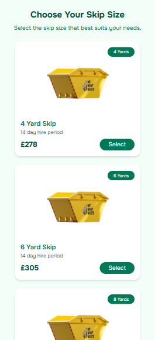
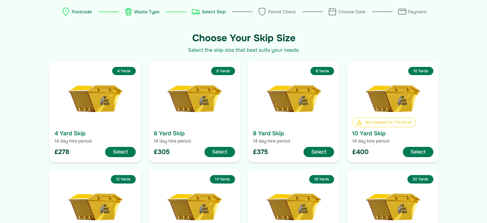

# ♻️ Skip Size Selector – GemWaste Redesign

Redesigned "Choose Your Skip Size" page from [We Want Waste](https://wewantwaste.co.uk), built with a fresh, eco-friendly, responsive layout and a focus on smooth user experience.

---

## ✨ Features

- ⚛️ Built with **React**, **TypeScript**, and **Tailwind CSS**
- 🌱 **Eco-friendly design** with subtle color palette and modern UI kit styling
- 📱 **Mobile-first layout** that adapts cleanly to desktop
- 🎯 **Data-driven** UI using live API from the company’s backend
- 💥 **Framer Motion** animations:
  - Skip card **selection pulse**
  - Smooth **layout transitions**
  - Subtle **hover glow**

---

## 🖼️ Screenshots

| Mobile View                                    | Desktop View                                     |
| ---------------------------------------------- | ------------------------------------------------ |
|  |  |

---

## 🚀 Tech Stack

- [React](https://react.dev)
- [TypeScript](https://www.typescriptlang.org/)
- [Tailwind CSS](https://tailwindcss.com/)
- [Framer Motion](https://www.framer.com/motion/)

---

## 📦 How to Run Locally

```bash
git clone https://github.com/manucho4015/skip-selector.git
cd skip-selector
npm install
npm run dev
```
